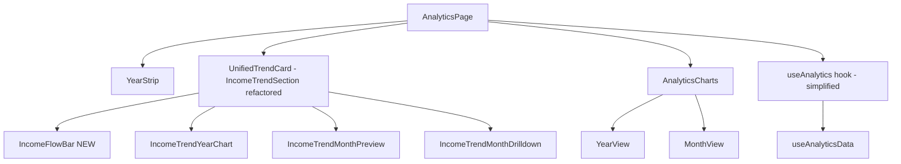
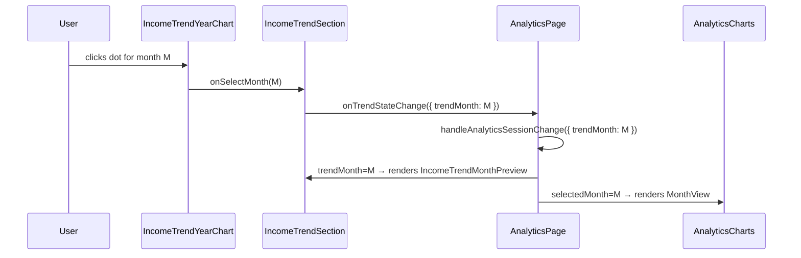
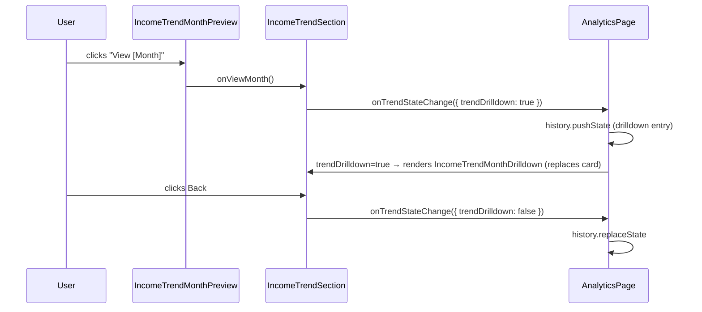

# Design Document: Analytics Page Restructure + IncomeFlowBar

## Overview

This spec covers two tightly coupled changes to the Outflow analytics page:

1. **Analytics Page Restructure** — Remove `MonthStrip` and consolidate month selection into the Net Remaining line chart. Unify `trendMonth` as the single selected-month signal. Wrap the income trend section (chart + IncomeFlowBar + preview/drilldown) in one unified card. `AnalyticsOverviewSection` (4-chip grid + overview band) is removed and replaced by `IncomeFlowBar`.

2. **IncomeFlowBar** — A new stacked horizontal bar component (`src/features/analytics/IncomeFlowBar.tsx`) that visualises income allocation. It is positioned **below the Net Remaining chart** and **morphs based on selection state**: when no month is selected it shows full-year / YTD data; when a month is selected it switches to that month's data. This makes it a contextual bridge between the chart and the detail view below.

The two features share a single unified card that becomes the primary navigation hub of the analytics page.

---

## Architecture

### Current layout (before)

```
AnalyticsPage
├── Header ("Analytics")
├── YearStrip
├── MonthStrip          ← month selector
├── AnalyticsOverviewSection
│   ├── 4-chip summary grid (YTD Income / Fixed / Savings / Expenses)
│   └── analytics-overview-band (trend headline, insight chips, table, pulse)
├── IncomeTrendSection  ← card: Net Remaining chart + MonthPreview/Drilldown
└── AnalyticsCharts     ← YearView or MonthView (driven by selectedMonth)
```

### New layout (after)

```
AnalyticsPage
├── Header ("Analytics")
├── YearStrip
└── UnifiedTrendCard    ← single rounded card (IncomeTrendSection)
    ├── "Net Remaining" heading + description
    ├── IncomeTrendYearChart  ← clicking a dot selects a month (trendMonth)
    ├── IncomeFlowBar   ← NEW: below chart, morphs on month selection
    │     ├── [trendMonth=null]  shows full-year / YTD data
    │     └── [trendMonth set]   shows selected month's data
    ├── [if trendMonth set] IncomeTrendMonthPreview (inline below bar)
    └── [if trendDrilldown] IncomeTrendMonthDrilldown (replaces whole card)
└── AnalyticsCharts     ← YearView (trendMonth=null) or MonthView (trendMonth set)
```

### Component dependency graph



---

## State Simplification

### Before

`AnalyticsSessionState` (in `useAnalytics.ts` / `App.tsx`):

```typescript
interface AnalyticsSessionState {
  year: number;
  selectedMonth: number | null;   // ← driven by MonthStrip
  trendMonth: number | null;      // ← driven by chart dot click
  trendDrilldown: boolean;
}
```

`useAnalytics` also maintained local state and callbacks for MonthStrip:
- `selectedMonth` local state + `setSelectedMonth`
- `availableMonths`, `prevMonth`, `nextMonth`, `jumpBackMonths`, `jumpToCurrentMonth`
- `isAtCurrentMonth`, `canPrevMonth`, `canNextMonth`

### After

`AnalyticsSessionState`:

```typescript
interface AnalyticsSessionState {
  year: number;
  // selectedMonth removed — trendMonth is the single source of truth
  trendMonth: number | null;
  trendDrilldown: boolean;
}
```

`useAnalytics` removes all MonthStrip-related state and callbacks. `trendMonth` is passed as `selectedMonth` to `AnalyticsCharts`.

### URL params

| Param | Before | After |
|-------|--------|-------|
| `year` | persisted | persisted (no change) |
| `trendMonth` | persisted | persisted (no change) |
| `trendDrilldown` | persisted | persisted (no change) |
| `selectedMonth` | persisted | **removed** |

---

## Sequence Diagrams

### Month selection flow (new)



### Drilldown flow (unchanged mechanism, new card context)



---

## Components and Interfaces

### 1. `AnalyticsPage` (modified)

**Removed**: `MonthStrip` import/usage, `selectedMonth` from session state, `AnalyticsOverviewSection`.

**Changed**: `trendMonth` passed as `selectedMonth` to `AnalyticsCharts`. `IncomeTrendSection` now receives `AnalyticsData` fields for `IncomeFlowBar`.

```typescript
// Props passed down to IncomeTrendSection (additions)
interface IncomeTrendSectionProps {
  // ... existing props ...
  // IncomeFlowBar data (new) — year-level
  yearTotalIncome: number;
  yearFixedTotal: number;
  yearVariableTotal: number;
  yearSavings: number;
  yearRemaining: number;
  monthCount: number;
  isCurrentYear: boolean;
  // IncomeFlowBar data (new) — month-level arrays (passed through from AnalyticsData)
  monthlyIncome: number[];
  monthlyFixed: number[];
  monthlyVariable: number[];
  monthlySavings: (number | null)[];
  monthlyRemaining: (number | null)[];
}
```

### 2. `IncomeTrendSection` (modified — becomes the unified card)

The section renders the chart first, then `IncomeFlowBar` below it. The bar morphs based on `trendMonth`.

**Responsibilities**:
- Render `IncomeTrendYearChart` at the top of the card (after the heading)
- Render `IncomeFlowBar` below the chart — passing year-level data when `trendMonth` is null, month-level data when `trendMonth` is set
- Conditionally render `IncomeTrendMonthPreview` below the bar when `trendMonth` is set and not in drilldown
- Conditionally render `IncomeTrendMonthDrilldown` when `trendDrilldown` is true (replaces entire card content)

### 3. `IncomeFlowBar` (new — `src/features/analytics/IncomeFlowBar.tsx`)

**Purpose**: Stacked horizontal bar showing income allocation. Positioned below the Net Remaining chart. Morphs between year-level and month-level data based on selection state.

**Morphing behaviour**:
- `selectedMonth = null` → headline shows "YTD Income" or "Total Income", bar uses `yearTotalIncome`, `yearFixedTotal`, `yearVariableTotal`, `yearSavings`, `yearRemaining`
- `selectedMonth = M` → headline shows the month name + "Income", bar uses `monthlyIncome[M]`, `monthlyFixedTotals[M]`, `monthlyVariableTotals[M]`, `monthlySavings[M]`, `monthlyRemaining[M]`

The transition between states should feel smooth — the bar re-computes segments and the headline label updates. No animation is required but the layout must not jump.

```typescript
interface IncomeFlowBarProps {
  // Year-level data (used when selectedMonth is null)
  yearIncome: number;           // yearTotalIncome
  yearFixed: number;            // yearFixedTotal
  yearVariable: number;         // yearVariableTotal
  yearSavings: number;          // yearSavings
  yearRemaining: number;        // yearRemaining
  // Month-level data arrays (used when selectedMonth is set)
  monthlyIncome: number[];
  monthlyFixed: number[];
  monthlyVariable: number[];
  monthlySavings: (number | null)[];
  monthlyRemaining: (number | null)[];
  // Selection state
  selectedMonth: number | null; // trendMonth — null = year view, 0–11 = month view
  // Context
  monthCount: number;           // isCurrentYear ? currentMonth + 1 : 12
  isCurrentYear: boolean;
  year: number;
  formatAmount: (n: number) => string;
}
```

**Internal state**:
```typescript
// Desktop hover tooltip
const [hoveredSegment, setHoveredSegment] = useState<{
  label: string;
  value: number;
  pct: number;
  left: number;   // px from bar left edge
} | null>(null);

// Mobile tap active segment
const [activeSegment, setActiveSegment] = useState<string | null>(null);
```

**Resolved values** (computed from props based on `selectedMonth`):
```typescript
const income    = selectedMonth !== null ? monthlyIncome[selectedMonth]    : yearIncome;
const fixed     = selectedMonth !== null ? monthlyFixed[selectedMonth]     : yearFixed;
const variable  = selectedMonth !== null ? monthlyVariable[selectedMonth]  : yearVariable;
const savings   = selectedMonth !== null ? (monthlySavings[selectedMonth] ?? 0)   : yearSavings;
const remaining = selectedMonth !== null ? (monthlyRemaining[selectedMonth] ?? 0) : yearRemaining;
```

**Headline label**:
- `selectedMonth = null, isCurrentYear = true` → "YTD Income · N months"
- `selectedMonth = null, isCurrentYear = false` → "Total Income · 12 months"
- `selectedMonth = M` → "{MonthLabel} Income"

### 4. `useAnalytics` (modified)

Removes: `selectedMonth` local state, `setSelectedMonth`, `availableMonths`, `prevMonth`, `nextMonth`, `jumpBackMonths`, `jumpToCurrentMonth`, `isAtCurrentMonth`, `canPrevMonth`, `canNextMonth`.

Return shape after:
```typescript
{
  year, handleYearChange,
  currentYear, currentMonth,
  canGoForward, lastMonth,
  summaryCards,   // kept for potential future use, or can be removed
  data, multiYearData,
  trendMonth, trendDrilldown,
}
```

### 5. `AnalyticsSessionState` (modified)

```typescript
export interface AnalyticsSessionState {
  year: number;
  trendMonth: number | null;
  trendDrilldown: boolean;
}
```

### 6. `AnalyticsCharts` (modified — interface only)

`selectedMonth` prop now receives `trendMonth` from `AnalyticsPage`. No internal logic changes needed.

### 7. Files to delete

- `src/features/analytics/MonthStrip.tsx`

### 8. Files to remove usage from

- `src/features/analytics/AnalyticsOverviewSection.tsx` — no longer rendered (file can be kept or deleted)
- `src/features/analytics/SummaryCard.tsx` — no longer rendered via `summaryCards` array (file can be kept or deleted)

---

## Data Models

### `IncomeFlowBar` segment model

```typescript
interface BarSegment {
  key: string;
  label: string;
  value: number;
  pct: number;           // value / income * 100, capped at 100
  color: string;         // resolved from ThemeColors
}

// Overflow segment (only when totalAllocated > income)
interface OverflowSegment {
  value: number;         // totalAllocated - income
  pct: number;           // overflow / income * 100
  color: string;         // colors.danger
}
```

### Segment order and color mapping

| Order | Segment | Value | Color |
|-------|---------|-------|-------|
| 1 | Savings | `savings` capped at `income` | `colors.success` |
| 2 | Fixed | `fixed` | `colors.primary` |
| 3 | Variable | `variable` | `colors.danger` |
| 4 | Remaining | `remaining` if > 0 | `getRemainingBarColor(remaining, baselineRemaining, ...)` |
| — | Overflow | `totalAllocated - income` if > 0 | `colors.danger` |

**Baseline remaining** (for `getRemainingBarColor`):
```
baselineRemaining = max(0, income - max(0, savings) - fixed)
```

This mirrors the same calculation used in `BudgetFlow.tsx`.

### `pct` helper

```typescript
function pct(value: number, total: number): number {
  if (total <= 0) return 0;
  return Math.min(100, Math.max(0, (value / total) * 100));
}
```

---

## Key Functions with Formal Specifications

### `getRemainingBarColor` (imported from `summaryColorUtils` pattern)

The function already exists in `BudgetFlow.tsx` as a local function. For `IncomeFlowBar`, it should be extracted to `summaryColorUtils.ts` and exported, or duplicated locally.

**Preconditions:**
- `remaining` is a finite number
- `baselineRemaining` is a finite number ≥ 0
- `successColor` and `dangerColor` are valid CSS color strings

**Postconditions:**
- Returns a CSS color string from `GREEN_TO_RED_SCALE` or the success/danger color
- Returns `dangerColor` when `remaining ≤ 0` or `baselineRemaining ≤ 0`
- Returns `successColor` when `remaining / baselineRemaining ≥ 50%`

### `IncomeFlowBar` render logic

**Preconditions:**
- `income ≥ 0`
- `fixed ≥ 0`, `variable ≥ 0`, `savings ≥ 0`
- `monthCount ≥ 1`

**Postconditions:**
- When `income = 0`: renders a zero-state placeholder, no bar segments
- When `totalAllocated ≤ income`: bar fills to ≤ 100%, remaining segment shown
- When `totalAllocated > income`: bar extends past 100%, overflow segment shown, dashed boundary line at 100%
- Tooltip shown on hover (desktop) or tap (mobile) for each segment
- Legend rows always rendered regardless of income value

**Loop invariants (segment rendering):**
- Each segment with `value > 0` renders a `div` with `width: pct%`
- Segments with `value = 0` are filtered out and not rendered
- Total rendered width = sum of all segment pcts (may exceed 100% in overflow case)

---

## Algorithmic Pseudocode

### IncomeFlowBar segment computation (with morphing)

```pascal
PROCEDURE computeSegments(selectedMonth, yearData, monthlyData)
  INPUT: selectedMonth: number | null
         yearData: { income, fixed, variable, savings, remaining }
         monthlyData: { income[], fixed[], variable[], savings[], remaining[] }
  OUTPUT: segments: BarSegment[], overflow: OverflowSegment | null, resolvedIncome: number

  SEQUENCE
    // Resolve values based on selection state
    IF selectedMonth IS NOT NULL THEN
      income    ← monthlyData.income[selectedMonth]
      fixed     ← monthlyData.fixed[selectedMonth]
      variable  ← monthlyData.variable[selectedMonth]
      savings   ← monthlyData.savings[selectedMonth] ?? 0
      remaining ← monthlyData.remaining[selectedMonth] ?? 0
    ELSE
      income    ← yearData.income
      fixed     ← yearData.fixed
      variable  ← yearData.variable
      savings   ← yearData.savings
      remaining ← yearData.remaining
    END IF

    IF income <= 0 THEN
      RETURN [], null, income
    END IF

    cappedSavings ← min(savings, income)
    totalAllocated ← cappedSavings + fixed + variable
    baselineRemaining ← max(0, income - max(0, savings) - fixed)
    remainingTone ← getRemainingBarColor(remaining, baselineRemaining, successColor, dangerColor)

    segments ← []

    IF cappedSavings > 0 THEN
      segments.push({ key: "savings", label: "Savings", value: cappedSavings,
                      pct: pct(cappedSavings, income), color: colors.success })
    END IF

    IF fixed > 0 THEN
      segments.push({ key: "fixed", label: "Fixed", value: fixed,
                      pct: pct(fixed, income), color: colors.primary })
    END IF

    IF variable > 0 THEN
      segments.push({ key: "variable", label: "Variable", value: variable,
                      pct: pct(variable, income), color: colors.danger })
    END IF

    IF remaining > 0 AND totalAllocated <= income THEN
      segments.push({ key: "remaining", label: "Remaining", value: remaining,
                      pct: pct(remaining, income), color: remainingTone })
    END IF

    overflow ← null
    IF totalAllocated > income THEN
      overflowAmt ← totalAllocated - income
      overflow ← { value: overflowAmt, pct: pct(overflowAmt, income), color: colors.danger }
    END IF

    RETURN segments, overflow, income
  END SEQUENCE
END PROCEDURE
```

### IncomeFlowBar tooltip positioning

```pascal
PROCEDURE handleSegmentMouseEnter(event, segment)
  INPUT: event: MouseEvent, segment: BarSegment
  OUTPUT: sets hoveredSegment state

  SEQUENCE
    parentRect ← event.currentTarget.parentElement.getBoundingClientRect()
    IF parentRect IS NULL THEN RETURN END IF

    setHoveredSegment({
      label: segment.label,
      value: segment.value,
      pct: segment.pct,
      left: event.clientX - parentRect.left
    })
  END SEQUENCE
END PROCEDURE
```

### Mobile tap toggle

```pascal
PROCEDURE handleSegmentClick(segmentKey)
  INPUT: segmentKey: string
  OUTPUT: toggles activeSegment state

  SEQUENCE
    IF activeSegment = segmentKey THEN
      setActiveSegment(null)   // dismiss
    ELSE
      setActiveSegment(segmentKey)
    END IF
  END SEQUENCE
END PROCEDURE
```

### AnalyticsPage — trendMonth as selectedMonth

```pascal
PROCEDURE renderAnalyticsPage(sessionState)
  INPUT: sessionState: AnalyticsSessionState
  OUTPUT: JSX

  SEQUENCE
    selectedMonth ← sessionState.trendMonth   // unified source of truth

    RENDER Header
    RENDER YearStrip

    RENDER IncomeTrendSection (unified card)
      WITH trendMonth = sessionState.trendMonth
      WITH trendDrilldown = sessionState.trendDrilldown
      WITH IncomeFlowBar data from data.*

    RENDER AnalyticsCharts
      WITH selectedMonth = selectedMonth   // trendMonth drives YearView vs MonthView
  END SEQUENCE
END PROCEDURE
```

---

## Example Usage

### IncomeFlowBar usage in IncomeTrendSection

```typescript
// Inside IncomeTrendSection
const monthCount = isCurrentYear ? currentMonth + 1 : 12;

<IncomeFlowBar
  // Year-level
  yearIncome={data.yearTotalIncome}
  yearFixed={data.yearFixedTotal}
  yearVariable={data.yearVariableTotal}
  yearSavings={data.yearSavings}
  yearRemaining={data.yearRemaining}
  // Month-level arrays
  monthlyIncome={data.monthlyIncome}
  monthlyFixed={data.monthlyFixedTotals}
  monthlyVariable={data.monthlyVariableTotals}
  monthlySavings={data.monthlySavings}
  monthlyRemaining={data.monthlyRemaining}
  // Selection state
  selectedMonth={trendMonth}
  // Context
  monthCount={monthCount}
  isCurrentYear={year === currentYear}
  year={year}
  formatAmount={formatAmount}
/>
```

### AnalyticsPage passing trendMonth to AnalyticsCharts

```typescript
// Before
<AnalyticsCharts selectedMonth={selectedMonth} ... />

// After
<AnalyticsCharts selectedMonth={trendMonth} ... />
```

### AnalyticsSessionState init in App.tsx

```typescript
// Before
return {
  year,
  selectedMonth: null,
  trendMonth,
  trendDrilldown,
};

// After
return {
  year,
  trendMonth,
  trendDrilldown,
};
```

---

## Correctness Properties

1. **Single source of truth**: At any point, `trendMonth` is the only value that determines which month is "selected" — it drives `IncomeTrendSection` (preview/drilldown), `IncomeFlowBar` (morphing), and `AnalyticsCharts` (YearView vs MonthView). There is no separate `selectedMonth` state.

2. **IncomeFlowBar morphing invariant**: When `trendMonth` changes from `null` to a month index M, `IncomeFlowBar` re-resolves all values from `monthlyIncome[M]`, `monthlyFixed[M]`, etc. When `trendMonth` returns to `null`, it re-resolves from year-level data. No stale data is shown.

3. **Bar width invariant (no overflow)**: When `savings + fixed + variable ≤ income` (using resolved values), the sum of all rendered segment widths is ≤ 100%.

2. **Bar width invariant (no overflow)**: When `savings + fixed + variable ≤ income`, the sum of all rendered segment widths equals exactly `pct(savings, income) + pct(fixed, income) + pct(variable, income) + pct(remaining, income)`, which is ≤ 100%.

3. **Bar overflow invariant**: When `savings + fixed + variable > income`, the overflow segment is rendered and a dashed boundary line appears at the 100% mark. The remaining segment is not rendered.

4. **Zero income guard**: When `income = 0`, `IncomeFlowBar` renders a zero-state placeholder and no bar segments or division-by-zero occurs.

5. **Savings cap**: The savings segment value is always `min(savings, income)` — it cannot exceed the total income bar width.

6. **Tooltip mutual exclusion (desktop)**: At most one segment tooltip is visible at a time. `hoveredSegment` is set to `null` on `onMouseLeave` of the bar container.

7. **Mobile tap toggle**: Tapping the same segment twice dismisses the tooltip (`activeSegment` returns to `null`). Tapping a different segment switches the active segment.

8. **URL param backward compatibility**: Removing `selectedMonth` from session state does not break existing URLs — `selectedMonth` was never persisted to URL params (only `year`, `trendMonth`, `trendDrilldown` were).

9. **Year change resets month**: When `handleYearChange` is called, `trendMonth` is reset to `null` and `trendDrilldown` to `false`, ensuring no stale month selection persists across year navigation.

10. **Drilldown back navigation**: Pressing the browser back button while in drilldown state sets `trendDrilldown: false` (via the existing `popstate` handler in `App.tsx`), returning to the chart + preview view.

---

## Error Handling

### `IncomeFlowBar` edge cases

| Condition | Handling |
|-----------|----------|
| `income = 0` | Render zero-state: "No income data for this period" placeholder; no bar rendered |
| `savings > income` | Cap savings segment at `income`; overflow segment shows the excess |
| `remaining < 0` (over budget) | Remaining segment not rendered; overflow segment shown instead |
| `monthCount = 0` | Should not occur (guarded by caller); bar renders with available data |
| All values = 0 | Zero-state placeholder shown |

### State transition edge cases

| Condition | Handling |
|-----------|----------|
| Year changes while drilldown active | `handleYearChange` resets `trendMonth: null, trendDrilldown: false` |
| `trendMonth` set to index beyond `lastMonth` | `IncomeTrendYearChart` only renders dots for months with data; invalid index produces no preview |
| `trendDrilldown: true` but `trendMonth: null` | Guarded in `IncomeTrendSection`: drilldown only renders when both are set |

---

## Testing Strategy

### Unit testing

**`IncomeFlowBar` segment computation** (pure logic, extract to utility if needed):
- `savings + fixed + variable < income` → remaining segment present, no overflow
- `savings + fixed + variable = income` → remaining = 0, no remaining segment, no overflow
- `savings + fixed + variable > income` → overflow segment present, no remaining segment
- `income = 0` → empty segments array returned
- `savings > income` → savings capped at income

**`useAnalytics` hook** (after simplification):
- Returns `trendMonth` from `sessionState`
- `handleYearChange` resets `trendMonth` and `trendDrilldown`
- Does not expose `selectedMonth`, `availableMonths`, or MonthStrip callbacks

### Property-based testing

**Property test library**: fast-check

**Property 1 — Bar width never exceeds 100% in normal case**:
For any `income > 0`, `savings ≥ 0`, `fixed ≥ 0`, `variable ≥ 0` where `savings + fixed + variable ≤ income`:
`sum(segment.pct for segment in segments) ≤ 100`

**Property 2 — Overflow only when over-allocated**:
For any inputs, `overflow !== null` if and only if `savings + fixed + variable > income`.

**Property 3 — Savings cap**:
For any `savings`, `income > 0`: the savings segment value is always `≤ income`.

### Integration testing

- Clicking a dot in `IncomeTrendYearChart` renders `IncomeTrendMonthPreview` below the chart
- Clicking "View [Month]" in `IncomeTrendMonthPreview` renders `IncomeTrendMonthDrilldown` replacing the card
- Clicking "Back" in drilldown returns to chart + preview
- `AnalyticsCharts` renders `MonthView` when `trendMonth` is set, `YearView` when null
- Year change via `YearStrip` clears `trendMonth` and returns to `YearView`

---

## Performance Considerations

- `IncomeFlowBar` is a pure presentational component with no data fetching. Segment computation is O(1) and does not need `useMemo`.
- Removing `MonthStrip` eliminates one `Strip` component and its scroll-sync logic from the render tree.
- `useAnalytics` becomes simpler — fewer `useCallback` and `useMemo` entries.
- `AnalyticsOverviewSection` removal eliminates `buildAnalyticsOverviewSnapshot` computation on every render (this was a non-trivial table-building operation).

---

## Security Considerations

No security-sensitive changes. This is a pure UI restructure with no new data access, no new API calls, and no changes to the storage layer.

---

## Dependencies

No new external dependencies. All patterns are sourced from existing code:

| Pattern | Source |
|---------|--------|
| Stacked bar + tooltip | `src/features/summary/BudgetFlow.tsx` |
| `AllocationRow` legend pattern | `src/features/summary/BudgetFlow.tsx` |
| `getRemainingBarColor` | `src/features/summary/BudgetFlow.tsx` (local fn — extract or duplicate) |
| `GREEN_TO_RED_SCALE` | `src/features/summary/summaryColorUtils.ts` |
| `ThemeColors` / `useThemeColors` | `src/features/analytics/AnalyticsCharts.tsx` |
| `useSettings` / `formatAmount` | `src/context/settingsContext.tsx` |
| `cn()` | `src/utils/cn.ts` |
